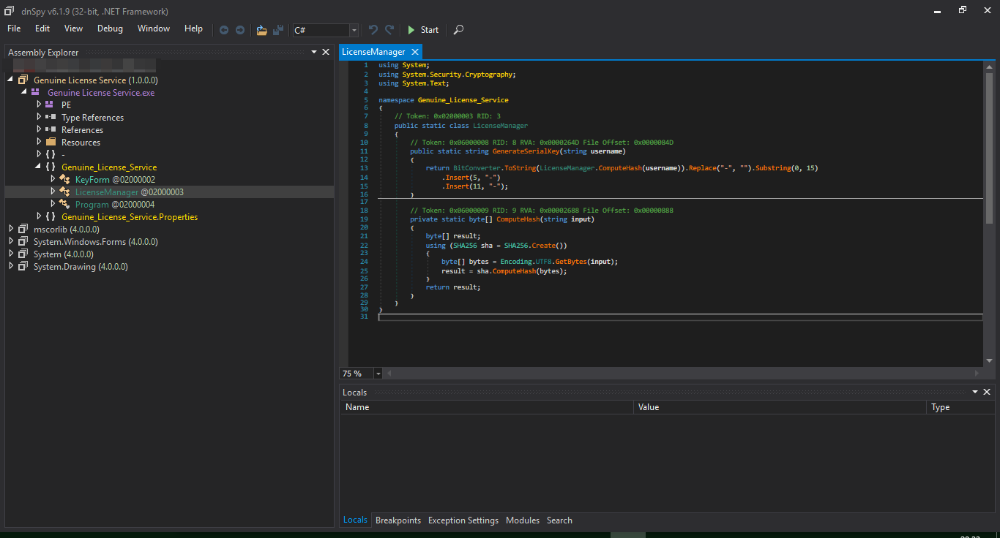
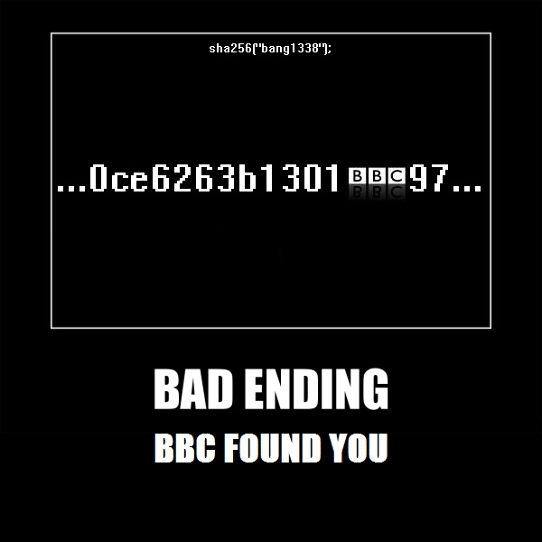

<h1 align="center">
RedXen's Genuine License Service
</h1>

<p align="center"> 
  <kbd>

  </kbd>
</p>

<h3 align="center">
Keygenned by bang1338
</h3>  

- crackmes.one ID: [`6422c9b833c5d447bc761e90`](https://crackmes.one/crackme/6422c9b833c5d447bc761e90)

## Challenge
- Put your name and key
- Push the button "Register", if the key along with your name correct, a messagebox say "This software has been activated successfully" and bottom-left status say "Activated" with green.

## Rulez
- No patching, of course.
- Serial fishing not allowed?
- Keygen only.

## How it processed:
<p align="center"> 
  <kbd>

  </kbd>
</p>  
  
1. SHA(2-)256 your name    

- In my case, `sha2-256("bang1338")` = `b419e1e1d840ce6263b1301bbc...`  
2. Take the string position from 0 to 5, 5 to 10, to to 15  
  
- In my case, `b419e1e1d840ce6263b1301bbc...` -> `b419e`, `1e1d8`, `40ce6`
3. Adding dash, uppercase (optional)
- `b419e`, `1e1d8`, `40ce6` -> `B419E-1E1D8-40CE6`

## How I discovered it
- Simple, just drag and drop it in dnSpy, find LicenseManager and boom, we found the keygen algo, in the crackme :)

<p align="center"> 
  <kbd>

  </kbd>
</p> 

## Solution - Keygen...
- With the algorithm we know, we can just make a simple Python script: 
```py
import hashlib

def compute_hash(input_str):
    sha = hashlib.sha256()
    sha.update(input_str.encode("utf-8"))
    return sha

def generate_serial_key(username):
    hash_result = compute_hash(username)
    serial_key = hash_result.hexdigest().replace("-", "")
    serial_key = f"{serial_key[:5]}-{serial_key[5:10]}-{serial_key[10:15]}"
    return serial_key.upper()

username = input("Enter your name: ")
serial_key = generate_serial_key(username)
print("Generated Serial Key:", serial_key)
input("bang1338, 2023")
# too lazy to make a C++ one with GUI
```

- Here's the result:
<p align="center"> 
  <kbd>

  </kbd>
</p> 

- Now we test it...
<p align="center"> 
  <kbd>

  </kbd>
</p> 

- Done, the keygen is working.

## Some (final) note
- This crackme is very easy, if you learn how to read C# code and use dnSpy
- The keygen is actually embedded in the crackme. Just for checking if serial match. aka: `if(mksr(sha2-256("bang1338")) == textbox) gg();`
- Unprotected, yes.

## Credit
- Elvis, for cheering :hugs:

## Bonus

<p align="center"> 
  <kbd>

  </kbd>
</p>  

## Further note of this
- For god sake please use markdown viewer for reading, recommend GitHub style :v
- I will using crackmes.one ID instead... wait i can just highlight link :v
- I will using image directly instead of using Discord for hosting.


##### bang1338, 2023.